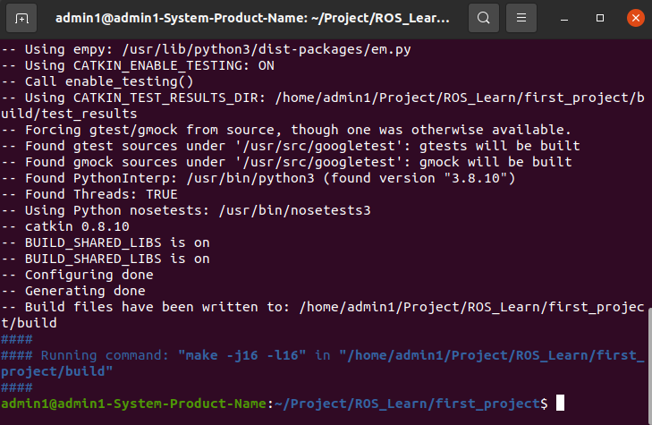

# 0. 参考资料

[autolabor](http://www.autolabor.com.cn/book/ROSTutorials/chapter1/12-roskai-fa-gong-ju-an-zhuang/124-an-zhuang-ros.html)

[autolabor on bilibili](https://www.bilibili.com/video/BV1Ci4y1L7ZZ?p=1&vd_source=ff498e5dc05e7bbe6be82c1d9e17f9fa)


# 1. 简单项目的实现介绍

ROS中的程序即便使用不同的编程语言，实现流程也大致类似，以当前HelloWorld程序为例，实现流程大致如下：

1. 先创建一个工作空间；
2. 再创建一个功能包；
3. 编辑源文件；
4. 编辑配置文件；
5. 编译并执行。


## 1. 创建工作空间并初始化

先创建一个项目`first_project`

```bash
mkdir -p ROS_Learn/first_project/src
```

然后进入这个工作空间，调用`catkin_make`命令编译

```bash
cd ROS_Learn/first_project
catkin_make
```

如下图所示，说明成功了。




## 2. 进入src创建ros包，并添加依赖

```bash
cd src
catkin_create_pkg first_package roscpp rospy std_msgs
```

其中，`first_package`为自定义包名。

这样操作之后会在工作空间下生成一个名为`first_package`的功能包，依赖于`roscpp`，`rospy`，`std_msgs`


# 2. C++实现

## 3. 进入ros包的src目录编辑源文件

```bash
cd first_package
```


在`first_package/src/helloworld.cpp`中用C++实现打印输出`hello world！`，这里的源文件名为自定义。

```c++
#include "ros/ros.h"

int main(int argc, char *argv[])
{
    //执行 ros 节点初始化
    ros::init(argc,argv,"hello");
    //创建 ros 节点句柄(非必须)
    ros::NodeHandle n;
    //控制台输出 hello world
    ROS_INFO("hello world!");

    return 0;
}
```


### 标红问题(optional)

这里如果不提前包含相应的`includePath`会标红，

可以在`.vscode/c_cpp_properties.json`中的`includePath`参数里添加相应索引目录

`/opt/ros/noetic/include/**`

```json
{
    "configurations": [
        {
            "name": "Linux",
            "includePath": [
                "${workspaceFolder}/**",
                "/opt/ros/noetic/include/**"
            ],
            "defines": [],
            "compilerPath": "/usr/bin/gcc",
            "cStandard": "c17",
            "cppStandard": "gnu++14",
            "intelliSenseMode": "linux-gcc-x64"
        }
    ],
    "version": 4
}
```


## 4. 编辑ros包下的CmakeLists.txt文件

找到`first_package/CmakeLists.txt`文件，取消注释修改成下面这样：

```cmake
add_executable(hello
  src/helloworld.cpp
)
target_link_libraries(hello
  ${catkin_LIBRARIES}
)
```

其中`hello`为自定义节点名，`add_executable`负责给两者构建映射关系，`target_link_libraries`中的第一个参数要和自定义节点名对应。


## 5. 进入工作空间并编译

```bash
cd first_project
catkin_make
```

生成`build`和`devel`等文件...

其中可执行文件在`devel/lib/first_project`下。


## 6. 执行

启动两个终端，分别输入

1. `roscore`，即启动ros核心
2. 运行ros节点，提前cd到工作空间：

```bash
cd first_project
source ./devel/setup.bash
rosrun first_package hello
```

最后打印输出。


# 3. launch文件演示

**作用：**

使用 launch 文件，可以一次性启动多个 ROS 节点。

## 具体实现

1. 选定功能包右击 ---> 添加 launch 文件夹

2. 选定 launch 文件夹右击 ---> 添加 launch 文件

3. 编辑 launch 文件内容

   ```
   <launch>
       <node pkg="helloworld" type="demo_hello" name="hello" output="screen" />
       <node pkg="turtlesim" type="turtlesim_node" name="t1"/>
       <node pkg="turtlesim" type="turtle_teleop_key" name="key1" />
   </launch>
   ```

   - node ---> 包含的某个节点
   - pkg -----> 功能包
   - type ----> 被运行的节点文件
   - name --> 为节点命名
   - output-> 设置日志的输出目标

4. 运行 launch 文件

   `roslaunch 包名 launch文件名`

5. 运行结果: 一次性启动了多个节点

