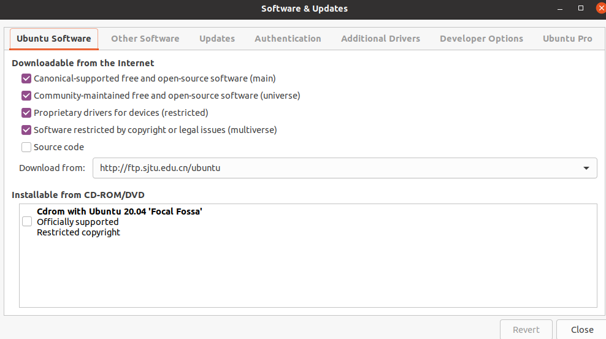
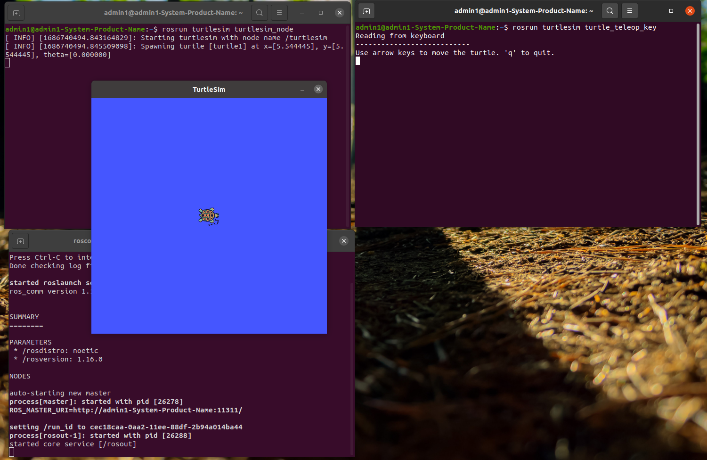

# 资料

[autolabor](http://www.autolabor.com.cn/book/ROSTutorials/chapter1/12-roskai-fa-gong-ju-an-zhuang/124-an-zhuang-ros.html)


# 1. 安装ROS

## 0. 准备工作

**一台20.04ubuntu的电脑**


配置ubuntu的软件和更新

打开`software & update`后按照下图进行配置（确保勾选了"restricted"， "universe，" 和 "multiverse."）




## 1. 设置安装源

这里直接使用国内中科大的安装源，安装更快

```bash
sudo sh -c '. /etc/lsb-release && echo "deb http://mirrors.ustc.edu.cn/ros/ubuntu/ `lsb_release -cs` main" > /etc/apt/sources.list.d/ros-latest.list'
```


## 2. 设置Key

```bash
sudo apt-key adv --keyserver 'hkp://keyserver.ubuntu.com:80' --recv-key C1CF6E31E6BADE8868B172B4F42ED6FBAB17C654
```


## 3. 安装

首先更新apt

```bash
sudo apt update
```


更新好之后安装最为常用的`Desktop-Full`版本，注意：这里的`noetic`适配的是20.02的ubuntu。

```bash
sudo apt install ros-noetic-desktop-full
```


安装的时候由于网络问题可能会失败，这里反复调用更新和安装命令，直到成功。


## 4. 配置环境变量

配置环境变量，方便在任意终端中使用ROS

```bash
echo "source /opt/ros/noetic/setup.bash" >> ~/.bashrc
source ~/.bashrc
```


## 5. 卸载(optional)

```bash
sudo apt remove ros-noetic-*
```


## 6. rosdep的安装

`rosdep`是一个用来安装`ros`所需依赖包的工具

`noetic`安装的时候没有构建，现在还用不上，这里先不管


# 2. 测试ROS

## 经典小乌龟测试

启动三个命令行，分别输入一下三个命令：

1. `roscore`，ros核心
2. `rosrun turtlesim turtlesim_node`，此时会弹出图形化界面
3. `rosrun turtlesim turtle_teleop_key`，在这个终端中通过上下左右键控制2中的乌龟




# 3. 一些工具

## 1. 终端`Terminator`

利用`apt`安装

```she
sudo apt install terminator
```

一些快捷键记录：

```
# 同一终端
Alt+Up                          //移动到上面的终端
Alt+Down                        //移动到下面的终端
Alt+Left                        //移动到左边的终端
Alt+Right                       //移动到右边的终端
Ctrl+Shift+O                    //水平分割终端
Ctrl+Shift+E                    //垂直分割终端
Ctrl+Shift+Right                //在垂直分割的终端中将分割条向右移动
Ctrl+Shift+Left                 //在垂直分割的终端中将分割条向左移动
Ctrl+Shift+Up                   //在水平分割的终端中将分割条向上移动
Ctrl+Shift+Down                 //在水平分割的终端中将分割条向下移动
Ctrl+Shift+S                    //隐藏/显示滚动条
Ctrl+Shift+F                    //搜索
Ctrl+Shift+C                    //复制选中的内容到剪贴板
Ctrl+Shift+V                    //粘贴剪贴板的内容到此处
Ctrl+Shift+W                    //关闭当前终端
Ctrl+Shift+Q                    //退出当前窗口，当前窗口的所有终端都将被关闭
Ctrl+Shift+X                    //最大化显示当前终端
Ctrl+Shift+Z                    //最大化显示当前终端并使字体放大
Ctrl+Shift+N or Ctrl+Tab        //移动到下一个终端
Ctrl+Shift+P or Ctrl+Shift+Tab  //Crtl+Shift+Tab 移动到之前的一个终端

# 不同终端
F11                             //全屏开关
Ctrl+Shift+T                    //打开一个新的标签
Ctrl+PageDown                   //移动到下一个标签
Ctrl+PageUp                     //移动到上一个标签
Ctrl+Shift+PageDown             //将当前标签与其后一个标签交换位置
Ctrl+Shift+PageUp               //将当前标签与其前一个标签交换位置
Ctrl+Plus (+)                   //增大字体
Ctrl+Minus (-)                  //减小字体
Ctrl+Zero (0)                   //恢复字体到原始大小
Ctrl+Shift+R                    //重置终端状态
Ctrl+Shift+G                    //重置终端状态并clear屏幕
Super+g                         //绑定所有的终端，以便向一个输入能够输入到所有的终端
Super+Shift+G                   //解除绑定
Super+t                         //绑定当前标签的所有终端，向一个终端输入的内容会自动输入到其他终端
Super+Shift+T                   //解除绑定
Ctrl+Shift+I                    //打开一个窗口，新窗口与原来的窗口使用同一个进程
Super+i                         //打开一个新窗口，新窗口与原来的窗口使用不同的进程
```

